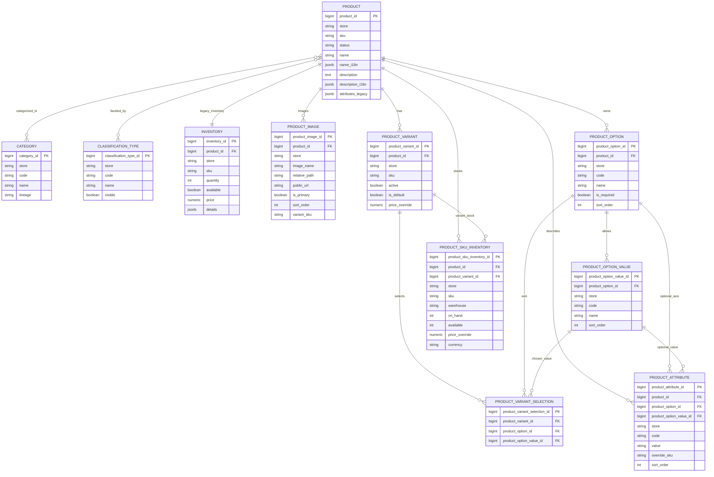

## Entity Relationship Diagram

```mermaid
erDiagram
    PRODUCT {
        bigint product_id PK
        string store
        string sku
        string status
        string name
        jsonb name_i18n
        text description
        jsonb description_i18n
        jsonb attributes_legacy
    }

    CATEGORY {
        bigint category_id PK
        string store
        string code
        string name
        string lineage
    }

    CLASSIFICATION_TYPE {
        bigint classification_type_id PK
        string store
        string code
        string name
        boolean visible
    }

    INVENTORY {
        bigint inventory_id PK
        bigint product_id FK
        string store
        string sku
        int quantity
        boolean available
        numeric price
        jsonb details
    }

    PRODUCT_IMAGE {
        bigint product_image_id PK
        bigint product_id FK
        string store
        string image_name
        string relative_path
        string public_url
        boolean is_primary
        int sort_order
        string variant_sku
    }

    PRODUCT_OPTION {
        bigint product_option_id PK
        bigint product_id FK
        string store
        string code
        string name
        boolean is_required
        int sort_order
    }

    PRODUCT_OPTION_VALUE {
        bigint product_option_value_id PK
        bigint product_option_id FK
        string store
        string code
        string name
        int sort_order
    }

    PRODUCT_VARIANT {
        bigint product_variant_id PK
        bigint product_id FK
        string store
        string sku
        boolean active
        boolean is_default
        numeric price_override
    }

    PRODUCT_VARIANT_SELECTION {
        bigint product_variant_selection_id PK
        bigint product_variant_id FK
        bigint product_option_id FK
        bigint product_option_value_id FK
    }

    PRODUCT_ATTRIBUTE {
        bigint product_attribute_id PK
        bigint product_id FK
        bigint product_option_id FK
        bigint product_option_value_id FK
        string store
        string code
        string value
        string override_sku
        int sort_order
    }

    PRODUCT_SKU_INVENTORY {
        bigint product_sku_inventory_id PK
        bigint product_id FK
        bigint product_variant_id FK
        string store
        string sku
        string warehouse
        int on_hand
        int available
        numeric price_override
        string currency
    }

    PRODUCT ||--o{ PRODUCT_OPTION : owns
    PRODUCT_OPTION ||--o{ PRODUCT_OPTION_VALUE : allows

    PRODUCT ||--o{ PRODUCT_VARIANT : has
    PRODUCT_VARIANT ||--o{ PRODUCT_VARIANT_SELECTION : selects
    PRODUCT_OPTION ||--o{ PRODUCT_VARIANT_SELECTION : axis
    PRODUCT_OPTION_VALUE ||--o{ PRODUCT_VARIANT_SELECTION : chosen_value

    PRODUCT ||--o{ PRODUCT_ATTRIBUTE : describes
    PRODUCT_OPTION ||--o{ PRODUCT_ATTRIBUTE : optional_axis
    PRODUCT_OPTION_VALUE ||--o{ PRODUCT_ATTRIBUTE : optional_value

    PRODUCT ||--o{ PRODUCT_SKU_INVENTORY : stocks
    PRODUCT_VARIANT ||--o{ PRODUCT_SKU_INVENTORY : variant_stock

    PRODUCT ||--o{ PRODUCT_IMAGE : images

    PRODUCT ||--|| INVENTORY : legacy_inventory

    PRODUCT }o--o{ CATEGORY : categorized_in
    PRODUCT }o--o{ CLASSIFICATION_TYPE : faceted_by
```